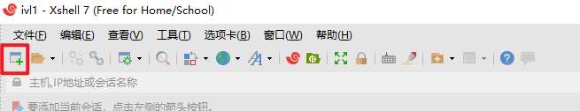
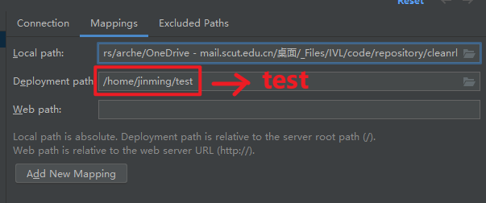

**写在前面**

一开始编写本指南主要是为新成员扫清一些使用服务器的障碍，避免重复教学，耽误时间。目前在仓库里还加入了些杂项的指南可供参考。
大家在阅读该指南时有任何疑虑或者好的建议，都可以提出来或者帮助撰写，让指南仓库不断完善，课题组GitHub主页：<https://github.com/IVL-SCUT>，快联系管理员加入组织吧。

**目录**

- [1. 服务器](#1-服务器)
- [2. 账户](#2-账户)
- [3. Python](#3-python)
- [4. 访问](#4-访问)
  - [4.1. Xshell](#41-xshell)
  - [4.2. PyCharm](#42-pycharm)
  - [4.3. VS Code](#43-vs-code)
- [5. 管理员相关](#5-管理员相关)
  - [5.1. 用户管理](#51-用户管理)
  - [5.2. Disk Usage](#52-disk-usage)

# 1. 服务器

`# 2024.03.26-2 15:31`
目前组内服务器情况如下：

| hostname | OS           | CPU             | GPU           | RAM   | Disk              |
| -------- | ------------ | --------------- | ------------- | ----- | ----------------- |
| ivl1     | Ubuntu 20.04 | AMD 5950x       | NVIDIA 3080Ti | 128GB | 1TB SSD + 2TB HDD |
| ivl2     | Ubuntu 22.04 | INTEL i9-14900K | NVIDIA 3090   | 32GB  | 2TB SSD           |
| ivl3     | Ubuntu 22.04 | INTEL i9-14900K | NVIDIA 3080Ti | 64GB  | 2TB SSD           |

# 2. 账户

找当前管理员添加账户到系统内，设置时注意：

- User name: 终端显示的名称，建议尽量简短，如：jinming
- Full name: 你的名称，显示在登录界面的名称，建议和 User name 一致
- Passwords: 登录密码，建议尽量简短，因为会大量使用

服务器有公用账户，密码见 OneDrive/passwords.txt，轻度使用可登录该账户，配置了常用的软件和 Python 包，服务器每次启动会默认登录该账户。

# 3. Python

统一使用 Anaconda 进行环境管理，Anaconda3 被安装在 `/opt/anaconda3` 中，所有用户都可以访问，只需要在个人配置 `.bashrc` 中添加环境变量（vim 语法可参考 <https://www.runoob.com/linux/linux-vim.html>）：

```Bash
# 编辑 .bashrc
>>> vim .bashrc
# 在最后一行添加以下语句
export PATH="/opt/anaconda3/bin:$PATH"
# 保存并退出，执行下面语句
>>> source .bashrc
# 然后就可以使用 conda 了，可以检查一下：
>>> conda -V
conda 4.10.3
```

注意，默认进入的 Python 环境是 base，base 已经安装了很多常用的包，供轻度使用。
如果是做自己的课题，强烈建议创建一个新的环境，以免污染 base 环境，创建新环境的命令如下：

```Bash
# 创建一个名为 myenv 的环境
>>> conda create -n myenv python=3.8
# 激活环境
>>> conda activate myenv
# 删除环境
>>> conda remove -n myenv --all
```

更多命令可自行学习 [conda 的命令](https://docs.conda.io/projects/conda/en/latest/commands.html)。

# 4. 访问

访问服务器有三个方案：

- 直接访问：服务器配有显示器和键鼠，空闲期间可直接当主机使用，同时只能有一人使用。

- 远程连接软件：所有服务器均取消远程桌面，仅供特殊情况使用。

- SSH：SSH (Secure Shell) 作为便携的远程访问协议，建议作为首要的服务器访问方式，可同时容纳多名用户。

这里重点介绍3种使用 ssh 的方式，Xshell，PyCharm，VS Code。

## 4.1. Xshell

Xshell可以创建多个会话窗口，给予你纯粹且轻量化的命令行交互方式。处理文件，运行写好的代码，都可以选择Xshell。

学生可以免费试用，申请网站 <https://www.netsarang.com/en/free-for-home-school/> ，记得同时申请 Xftp，用于传输文件。

初次连接，打开 Xshell，选择新建会话窗口，



填入会话名称（随意，用于区分不同主机），主机地址（服务器 ip 地址，OneDrive 里面有），端口号用默认的22，然后点击**用户身份验证**，


填入服务器账户名和密码，


最后点击**连接**即可：


后续可直接双击保存的会话进入。Xftp 连接基本一样，不再赘述。

## 4.2. PyCharm

PyCharm 配置好远程服务器之后，可直接用远程（remote）资源（GPU、CPU等）运行并调试代码。运行逻辑上就是调用了服务器上的解释器（interpreter），如果你不懂什么是解释器，建议弄懂之后再来看本教程。

具体操作上，默认你已具备基本的利用 PyCharm 开发程序的知识。首先打开 PyCharm，打开设置，选择 SSH Configuration：


填写相关信息，完成后，测试一下连接状况，没问题的话会显示成功：


这样，SSH 就配置成功了。

然后配置解释器，在主界面右下角点击添加解释器：


选择刚刚配置好的 server configuration.


然后下一步，选择正确的解释器的路径，并配置好文件映射，下图中，项目文件夹就会和远程的 `test` 文件夹保持同步，勾选上自动上传，点击 Finish` 即可。


之后应该会看到右下角弹出部署完成的信息：


点击 `Configure` 进去看一下：


可以看到按照刚才的配置把文件映射根目录定位到了 `/`，这里建议修改一下，改成自己 `home` 文件夹所在位置：


然后点击 `Mappings`，把项目文件夹改成正确的地址：



因为实际的映射路径是 `Root path` ＋ `Deployment path`。改好之后，点击 `Apply`：


至此就大功告成了，可以随意选择一个脚本文件运行一下：


可以看到能够成功运行，且运行的是远程的文件。

此外，远程的文件夹也可以预览，只需要开启 `Remote Host` 侧边栏即可，同步的文件夹会以浅绿色显示：


没有 `Remote Host` 侧边栏的话可以在顶部视图选项里找到：


另外，以后当你打开一个新的项目文件夹时，解释器可以直接选之前配置好的：


就不用再重复添加解释器了，但注意要重新部署文件夹映射，因为我们换了一个新的文件夹，`部署设置`在顶部的工具选项里：


重新填写 `Mappings` 里的路径，填好后，点击确定，然后关闭设置，右键点击本地要同步的文件夹，选择与远程同步：


就可以在侧边栏看到文件都同步至新的文件夹了，同样以浅绿色显示：


## 4.3. VS Code

Visual Studio Code 是一款轻量化但极为强大的编辑器，有着丰富的语言支持和插件生态。当你有多语言开发需求的时候，可以试试 VS Code，当然，重度开发还是得上专用的 IDE。

<!-- 步入正题，首先先在扩展里面搜索并安装 `Remote - SSH`：

 -->

具体操作可以参考这个教程<https://blog.csdn.net/weixin_50548064/article/details/122664871>，写得简洁明了，其中上传公钥那一步，可以用之前申请的 Xftp，其它的照着来就好了。

这里简单复制一下上面的教程，方便查看：

- Win+R 打开命令行，输入 `ssh-keygen`，一路回车，生成密钥对。默认生成在 `C:\Users\用户名\.ssh` 下，公钥是 `id_rsa.pub`，私钥是 `id_rsa`。
- 如果这是你第一次上传公钥到此台服务器，那么需要先创建一些文件夹：
  - 在服务器上创建 `.ssh` 文件夹：`mkdir ~/.ssh`
  - 在服务器上创建 `authorized_keys` 文件：`touch ~/.ssh/authorized_keys`
- 上传公钥到服务器：
  - 用 Xftp 连接服务器，把本地的 `id_rsa.pub` 上传到服务器的 `~/.ssh` 文件夹下。
  - 在服务器上执行：`cat ~/.ssh/id_rsa.pub >> ~/.ssh/authorized_keys`
- 配置 VS Code：
  - 安装 `Remote - SSH` 插件。
  - 点击左下角的 `><`，选择 `Connect to Host... -> Configure SSH Hosts... -> C:\Users\用户名\.ssh\config`。
  - 在 `config` 文件中添加：

    ```txt
    Host 服务器别名(ivl3-jinming)
        HostName 服务器地址(10.32.xxx.xxx)
        User 服务器用户名(jinming)
        IdentityFile C:\Users\用户名\.ssh\id_rsa
    ```

  - 之后就可以直接连接了，点击左下角的 `><`，选择 `Connect to Host... -> 服务器别名(ivl3-jinming)`。

# 5. 管理员相关

如果你是管理员，下面这些命令对你来说可能会很有用。

## 5.1. 用户管理

```bash
sudo adduser username  # 添加一个新用户 username
sudo passwd username  # 为用户 username 设置密码, 也可以用 passwd 命令修改用户密码
sudo userdel -r username  # 删除用户 username 及其目录
sudo groupadd -g 1000 groupname  # 添加一个新组 groupname, gid 为 1000
sudo groupdel groupname  # 删除组 groupname
sudo gpasswd -a username groupname  # 将用户 username 添加到组 groupname
sudo gpasswd -d username groupname  # 将用户 username 从组 groupname 中删除
sudo groupmod -n newgroupname groupname  # 将组 groupname 改名为 newgroupname
sudo id username  # 查看用户 username 的信息: uid, gid, groups
sudo finger username  # 查看用户 username 的信息: uid, gid, groups, home, shell
sudo usermod -a -G groupname username  # 将用户 username 添加到组 groupname
cat /etc/passwd  # 查看所有用户信息
cat /etc/group  # 查看所有组信息
```

## 5.2. Disk Usage

```bash
sudo du -sh *  # 查看当前目录下所有文件夹的大小
```
